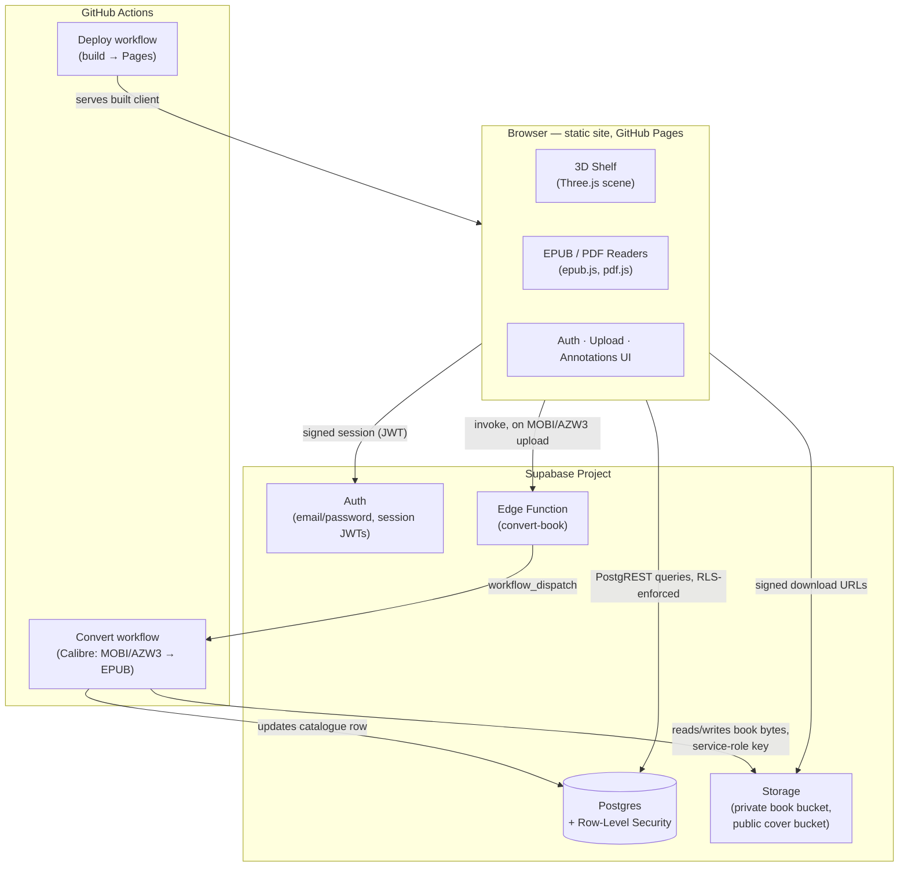
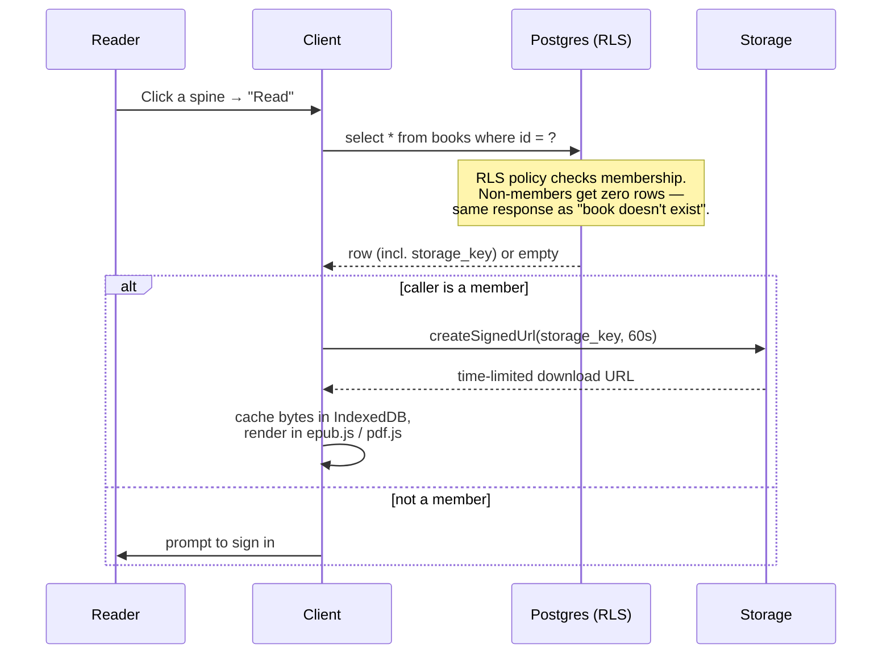
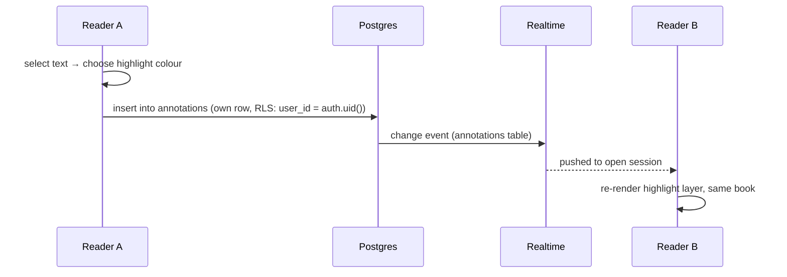
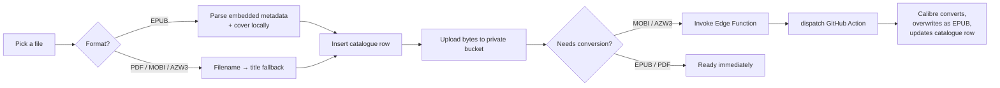
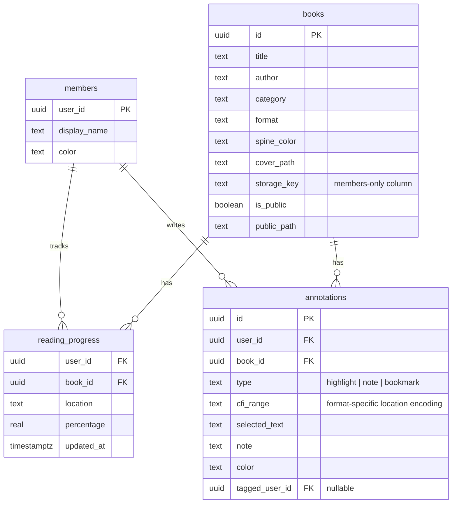
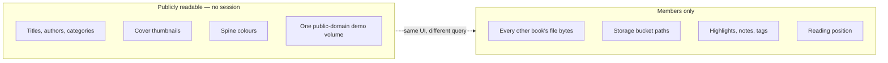
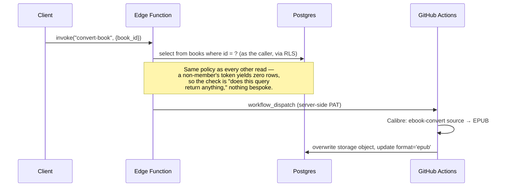

# The Complete Shelf

A private, interactive 3D digital library. Books render as a browsable shelf
of spines in a real-time WebGL scene; opening one launches a full EPUB or PDF
reader with highlights, notes, and cross-device sync shared between a small,
invite-only circle of readers.

The interesting engineering problem this project solves isn't the 3D shelf —
it's that a fully static site (GitHub Pages) has no server to gate access
with, so "make part of this private" has to be solved entirely through
database-level authorization rather than application code. Everything below
documents how that constraint shaped the architecture.

---

## Table of contents

- [High-Level Design](#high-level-design)
  - [System overview](#system-overview)
  - [Core design constraint](#core-design-constraint)
  - [Data flow: opening a book](#data-flow-opening-a-book)
  - [Data flow: annotating and syncing](#data-flow-annotating-and-syncing)
  - [Data flow: adding a book](#data-flow-adding-a-book)
- [Low-Level Design](#low-level-design)
  - [Client module map](#client-module-map)
  - [Database schema](#database-schema)
  - [Authorization model](#authorization-model)
  - [The public/private split](#the-publicprivate-split)
  - [Reader engines](#reader-engines)
  - [Annotation encoding](#annotation-encoding)
  - [Edge Function: format conversion](#edge-function-format-conversion)
- [Tech stack](#tech-stack)
- [Notable engineering decisions](#notable-engineering-decisions)
- [Known limitations](#known-limitations)
- [Local development](#local-development)

---

## High-Level Design

### System overview



The client is a static bundle with no backend of its own. Every piece of
state that needs to be private, shared, or durable — who can read what,
who highlighted which passage, how far each person has read — lives in
Postgres and is reached only through Supabase's client library. There is no
custom API server; PostgREST (Supabase's auto-generated REST layer over
Postgres) *is* the API, and its authorization is enforced by the database
itself, not by application code that happens to run first.

### Core design constraint

GitHub Pages serves files. It cannot run a login check before deciding
whether to hand one over. That single fact rules out the usual instinct for
"private area of a public site" (an app-level password gate) — a client-side
check can restrict what a UI *shows*, but the underlying file is still just
sitting at a public URL if that's where it's hosted, retrievable directly by
anyone who finds the link.

The resolution: books never live in the repository or on Pages at all. They
live in a private Supabase Storage bucket, reachable only through
short-lived signed URLs that Supabase will issue only after evaluating a
Row-Level Security policy against the caller's session. The authorization
boundary moved from "a page the user might reach" to "a query the database
will or won't answer" — the only boundary a purely static frontend can't
route around.

### Data flow: opening a book



Anonymous visitors query a *view* (`public_catalogue`) rather than the table
directly — the view's column list simply omits `storage_key`, so there is no
code path, no bug, no oversight that could leak a file location to someone
who was never supposed to have it. The column doesn't exist in what they can
select.

### Data flow: annotating and syncing



Every mark is one Postgres row: who made it, which book, a location encoded
for that format (below), the passage text, an optional note, and an optional
"tagged" reader. RLS grants every member read access to every row and write
access only to their own — the shared margin and the "only you can edit your
own note" rule are the *same* mechanism, not two separate features that
could drift out of sync.

### Data flow: adding a book



---

## Low-Level Design

### Client module map

```
src/
├── core/SceneManager.ts        WebGL scene, camera, lighting, resize handling
├── components/
│   ├── ShelfManager.ts         Shelf layout, scroll physics, category filtering
│   └── BookComponent.ts        Procedural spine geometry + texture per book
├── interaction/
│   └── InteractionManager.ts   Pointer/drag/hover, keyboard shelf navigation
├── auth/AuthManager.ts         Session state, membership, circle roster
├── data/
│   ├── supabase.ts             Client singleton
│   ├── Catalogue.ts            Table-vs-view selection by membership
│   ├── BookVault.ts            Signed URLs, IndexedDB byte cache
│   ├── ProgressStore.ts        Per-user reading position, debounced sync
│   ├── AnnotationStore.ts      Highlights/notes CRUD + Realtime subscription
│   ├── ConversionTrigger.ts    Edge Function invocation for format conversion
│   └── ReaderSettings.ts       Device-local prefs (font, theme) — deliberately
│                                not synced; a phone's font size isn't a fact
│                                about the book, it's a fact about the phone
├── readers/
│   ├── EPUBReader.ts           epub.js wrapper: pagination, themes, fonts,
│   │                           highlight rendering, selection → annotation
│   └── PDFReader.ts            pdf.js wrapper: canvas rendering, text layer,
│                               fraction-based highlight positioning
└── ui/
    ├── UIManager.ts            Shelf chrome, auth modal, book-open orchestration
    ├── AnnotationUI.ts         Highlight popup, note editor — reader-agnostic
    ├── NotesLibraryUI.ts       Cross-book annotation view, filtering, tagging
    └── UploadPanel.ts          Add-book flow, metadata extraction
```

`AnnotationUI` is written against *either* reader through a small structural
interface (`activeBookId`, `onSelection`, `renderAnnotations()`,
`displayAt()`) rather than being duplicated per format — since exactly one
reader is ever open at a time, "the active reader" is simply whichever one
currently reports a book id.

### Database schema



`public_catalogue` and `public_files` are views over `books`, not separate
tables — `public_catalogue` exposes the shelf-art columns to anyone,
`public_files` additionally exposes `storage_key` but *only* for rows where
`is_public = true`, letting one demo volume be readable with no session at
all while every other row's location stays behind membership.

### Authorization model

Three roles, enforced at the database layer via Postgres RLS policies —
never in client code, which can always be inspected or bypassed:

| | Anonymous | Signed in, not a member | Member |
|---|---|---|---|
| Shelf art (titles, covers, spines) | ✅ | ✅ | ✅ |
| Public-domain demo volume | ✅ | ✅ | ✅ |
| Any other book's bytes | ❌ | ❌ | ✅ |
| Storage locations | never sent | never sent | ✅ |
| Read others' highlights/progress | ❌ | ❌ | ✅ |
| Write own highlights/progress | ❌ | ❌ | ✅ |
| Write someone else's row | ❌ | ❌ | ❌ (RLS blocks regardless of session) |

Membership is deliberately **not** self-service: signing up creates a
Supabase Auth user, which is necessary but not sufficient. Every RLS policy
gates on a `is_member()` function checking a *separate* `members` table that
only an existing member can insert into. A stranger who discovers the
sign-up form gets a session and the public shelf view — nothing more.

### The public/private split



This split is the actual point of the project: a *browsable, presentable*
shelf that any visitor (or portfolio reviewer) can explore, while the
content each book represents stays genuinely private to its circle — backed
by database policy, not by security-through-obscurity of a URL.

### Reader engines

Two independent rendering paths, chosen per book's `format`:

- **EPUB** — [epub.js](https://github.com/futurepress/epub.js), given the
  book's raw `ArrayBuffer` directly rather than a blob URL (epub.js infers
  archive type from the URL's extension; a `blob:` URL has none). Theming
  and font overrides are applied as `!important` CSS rules scoped to
  `body.<theme-name>`, and re-appended — not merely updated in place — on
  every change, so a rule can never lose a DOM-order tie against a book's
  own embedded stylesheet.
- **PDF** — [pdf.js](https://github.com/mozilla/pdf.js), rendered to
  `<canvas>` with a parallel, invisible selectable text layer for
  highlighting. Highlight geometry is stored as *fractions* of the page
  (`x, y, w, h` ∈ [0, 1]) rather than pixels, since the canvas is re-scaled
  from `window.innerHeight` on every render — a pixel-based rectangle would
  drift out from under its own text the moment the window resized.

### Annotation encoding

A highlight's location has to mean the same thing regardless of device,
zoom, or window size, and EPUB and PDF have no shared native concept of
"where." Both are folded into one `cfi_range` text column with a
format-specific encoding:

- **EPUB** — a standard [CFI](https://idpf.org/epub/linking/cfi/) (Canonical
  Fragment Identifier), epub.js's own stable-location format.
- **PDF** — `pdf:<page>:<x,y,w,h>;<x,y,w,h>;…`, one rectangle per visual
  line the selection spans, each a fraction of the page's own dimensions.

Storing both as opaque text in the same column, distinguished by a prefix,
means the annotation store, the sync layer, and the shared-margin UI don't
need to know or care which reader produced a given mark.

### Edge Function: format conversion

MOBI/AZW3 have no browser-native renderer. Rather than build one, the
Edge Function pattern converts them once, upfront, into a format the
existing readers already handle:



The GitHub token this needs never reaches the browser — a token with
`workflow` scope inside a public client bundle would let anyone holding the
(intentionally public) anon key trigger arbitrary CI runs. It exists only as
the Edge Function's own server-side secret, and the function re-derives
membership from the caller's own session rather than re-implementing the
check, so there is exactly one definition of "may read this book" in the
whole system, not two that could quietly disagree.

---

## Tech stack

| Layer | Choice | Why |
|---|---|---|
| Rendering | Three.js | Real-time 3D shelf, procedural spine geometry |
| Language | TypeScript, strict mode | Compile-time safety across a fairly deep module graph |
| Build | Vite | Fast dev server, ES module output |
| Backend | Supabase (Postgres, Auth, Storage, Realtime, Edge Functions) | One platform for every "server" concern a static frontend can't own itself; RLS gives a single, auditable authorization surface |
| EPUB rendering | epub.js | Pagination, CFI locations, theming hooks |
| PDF rendering | pdf.js | Canvas rendering + selectable text layer |
| CI/CD | GitHub Actions | Static deploy, format conversion, keep-alive ping |
| Hosting | GitHub Pages | Free, static — the entire reason the backend had to be *this* shape |

## Notable engineering decisions

- **RLS as the only authorization surface.** Every access rule — membership,
  ownership, the public/private book split — is a Postgres policy, checked
  by the database on every query regardless of which client code path got
  there. Nothing about "who can see this" is duplicated in application
  logic, so there is nothing for two copies of a rule to disagree about.
- **Views instead of column filtering in application code.** The public
  catalogue is a database view with a narrower column list, not a
  server-side or client-side filter over the full row. There is no filter
  to forget to apply.
- **Fraction-based, not pixel-based, spatial encoding.** Both the PDF
  highlight rectangles and the font-override CSS are written to survive
  re-render at an arbitrary size, rather than assuming today's layout is
  permanent.
- **A private git history, not just a private deploy.** Static hosting
  means anything ever committed to the repository is one clone away from
  anyone, indefinitely — a `.gitignore` only stops *new* commits, not old
  ones. Making a repository like this genuinely private required a
  history rewrite (`git filter-repo`) as a one-time operational step, not
  just a code change.

## Known limitations

- PDF text extraction quality depends entirely on the source PDF's own
  embedded text layer; a scanned/image-only PDF has nothing to select.
- MOBI/AZW3 conversion depends on an external CI-based pipeline (Calibre via
  GitHub Actions) rather than in-browser conversion — intentional, since
  running that pipeline client-side isn't practical, but it means
  conversion has a small latency window rather than being instant.
- Free-tier hosting constraints (Supabase Storage, GitHub Actions minutes)
  cap the practical library size; the architecture doesn't, and the storage
  layer is swappable (see `worker/README.md` for the migration path to
  larger object storage).

## Local development

```bash
npm install
cp .env.example .env.local   # fill in your own Supabase project values
npm run dev
```

Full backend setup (schema, storage buckets, auth, Edge Function
deployment) is documented in [`docs/SETUP.md`](docs/SETUP.md). The app runs
and renders the shelf with zero configuration — only book access requires a
configured backend.
